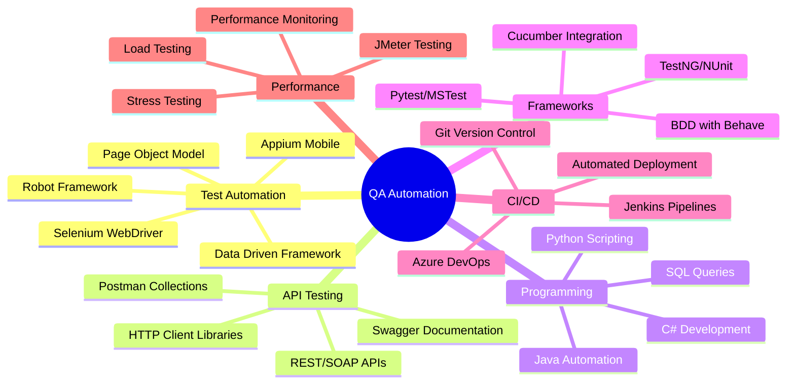

# 👋 Hi there, I'm Deepak Kona!

<div align="center">
  
[](https://git.io/typing-svg)

</div>

<div align="center">
  

[](https://github.com/deepakkona)
[](https://github.com/deepakkona)

</div>

---

## 🚀 About Me

```python
class DeepakKona:
    def __init__(self):
        self.name = "Deepak Kona"
        self.role = "QA Automation Engineer | SDET"
        self.location = "Ahmedabad, India"
        self.experience = "4+ Years"
        self.email = "deepak.kona815@gmail.com"
        self.phone = "09173701132"
        
    def current_work(self):
        return {
            "company": "Volansys Technologies",
            "position": "SDET Engineer",
            "focus": ["Test Automation", "API Testing", "Performance Testing"],
            "domains": ["Renewable Energy", "Healthcare", "Logistics"]
        }
        
    def expertise(self):
        return ["Selenium", "Python", "C#", "API Testing", "CI/CD", "Agile"]
```

<div align="center">


</div>

---

## 🛠️ Tech Stack & Tools

<div align="center">

### Programming Languages
[](https://python.org)
[](https://docs.microsoft.com/en-us/dotnet/csharp/)
[](https://java.com)

### Automation Frameworks & Tools
[](https://selenium.dev)
[](https://appium.io)
[](https://testng.org)
[](https://robotframework.org)
[](https://pytest.org)

### API Testing
[](https://postman.com)
[](https://swagger.io)
[](https://restfulapi.net)

### CI/CD & DevOps
[](https://jenkins.io)
[](https://azure.microsoft.com/en-us/services/devops/)
[](https://git-scm.com)
[](https://bitbucket.org)

### Project Management
[](https://atlassian.com/software/jira)
[](https://gurock.com/testrail)

### Performance Testing
[](https://jmeter.apache.org)

</div>

---

## 📊 GitHub Stats

<div align="center">
  


</div>

---

## 🏆 Professional Experience

### 🔹 Current Role: SDET Engineer @ Volansys Technologies
**May 2024 - Present | Ahmedabad, India**

<div align="center">


</div>

🎯 **Key Achievements:**
- 🚀 Designed comprehensive QA automation framework for Log R Met data logger
- ⚡ Developed automated test scripts using Selenium & Python
- 🔌 Implemented end-to-end validation for Modbus communication protocols
- 📊 Reduced test cycles by 60% through automation
- 🎯 Improved defect detection rates significantly

### 🔹 QA Automation Engineer @ JigNect Technologies
**Jan 2022 - May 2024 | Ahmedabad, India**

🎯 **Project: Agility Health (USA Client)**
- 🌐 Web Application Testing & Automation
- 🔧 Tools: Selenium + C#, Swagger, Azure DevOps
- 📈 Helped organizations transition to agile methodologies

### 🔹 QA Engineer @ Namastey Digital India
**Sep 2020 - Dec 2021 | Ahmedabad, India**

🎯 **Project: Sphere WMS (CEVA Logistics)**
- 📦 Logistics & Warehouse Management System
- 🔧 Tools: Selenium + Python, Postman, JIRA

---

## 🎯 Key Projects

<div align="center">

### 🌱 Renewable Energy Measurement System


**Tech Stack:** Python | Selenium | Modbus | PyModbus

🔹 Automated solar & wind measurement data validation  
🔹 Real-time data stream simulation  
🔹 Industrial IoT device testing  
🔹 Performance benchmarking & compliance testing  

</div>

<div align="center">

### 🏥 Agility Health Platform


**Tech Stack:** C# | Selenium | API Testing | Azure DevOps

🔹 Agile transformation consultancy platform  
🔹 End-to-end web application testing  
🔹 API automation & integration testing  
🔹 CI/CD pipeline implementation  

</div>

<div align="center">

### 📦 Logistics Management System


**Tech Stack:** Python | Selenium | REST API | Postman

🔹 Warehouse management system testing  
🔹 Supply chain automation validation  
🔹 Multi-modal logistics testing (Air/Ocean/Ground)  
🔹 CEVA Matrix® platform integration  

</div>

---

## 🏅 Skills & Expertise

<div align="center">



</div>

### 🎯 Core Competencies

| Category | Skills |
|----------|--------|
| **🔧 Automation Tools** | Selenium, Appium, TestNG, Robot Framework, Pytest |
| **💻 Programming** | Python, C#, Java, SQL |
| **🌐 API Testing** | Postman, Swagger, REST/SOAP, HttpClient |
| **🚀 CI/CD** | Jenkins, Azure DevOps, Git, Bitbucket |
| **📊 Project Management** | Jira, TestRail, Agile/Scrum |
| **⚡ Performance** | JMeter, Load Testing, Performance Monitoring |

---

## 📈 Achievement Metrics

<div align="center">

| Metric | Value | Description |
|--------|-------|-------------|
| 🎯 **Test Automation Coverage** | 85%+ | Automated test coverage across projects |
| ⚡ **Test Execution Speed** | 60% Faster | Reduced manual testing time |
| 🐛 **Bug Detection Rate** | 40% Increase | Early defect identification |
| 🔄 **CI/CD Implementation** | 100% | All projects with automated pipelines |
| 👥 **Team Collaboration** | Cross-functional | Agile/Scrum methodology expert |

</div>

---

## 🎓 Education & Certifications

🎓 **Bachelor of Engineering - Electronics and Communications**  
📍 Gujarat Technological University (GTU)  
📅 September 2016 - September 2020  
🏛️ Bhavnagar, India  

---

## 🌐 Languages

<div align="center">

| Language | Proficiency |
|----------|-------------|
| 🇺🇸 **English** | ████████████ 100% |
| 🇮🇳 **Hindi** | ████████████ 100% |
| 🇮🇳 **Gujarati** | ████████████ 100% |
| 🇮🇳 **Marathi** | ████████████ 100% |
| 🇮🇳 **Kannada** | ██████████░░ 85% |

</div>

---

## 📫 Let's Connect!

<div align="center">

[](mailto:deepak.kona815@gmail.com)
[](tel:+919173701132)
[](https://linkedin.com/in/deepakkona)
[](https://github.com/deepakkona)

</div>

---

<div align="center">

### 💼 Open for Opportunities

🚀 **I'm actively looking for challenging roles in:**
- QA Automation Engineering
- SDET Positions  
- Test Architecture
- DevOps & CI/CD


</div>

---

<div align="center">

## 🎨 Fun Facts About Me

- 🔬 I love turning manual tests into automated masterpieces
- 🐛 Bug hunting is my superpower
- 🚀 Always exploring new testing frameworks and tools  
- 📚 Continuous learner in the QA automation space
- ⚡ I believe good automation can save the world (one test at a time!)


</div>

---

<div align="center">

### 📊 Weekly Development Breakdown

```text
Python      ████████████████████████░   96.2%
C#          ██████████████████░░░░░░░   72.8%
Java        ████████████░░░░░░░░░░░░░   48.5%
SQL         ██████████░░░░░░░░░░░░░░░   42.3%
JavaScript  ████████░░░░░░░░░░░░░░░░░   32.1%
```

</div>

---

<div align="center">


**Thanks for visiting my profile! Let's build quality software together! 🚀**


⭐ **If you like my work, please consider giving a star to my repositories!**

</div>
